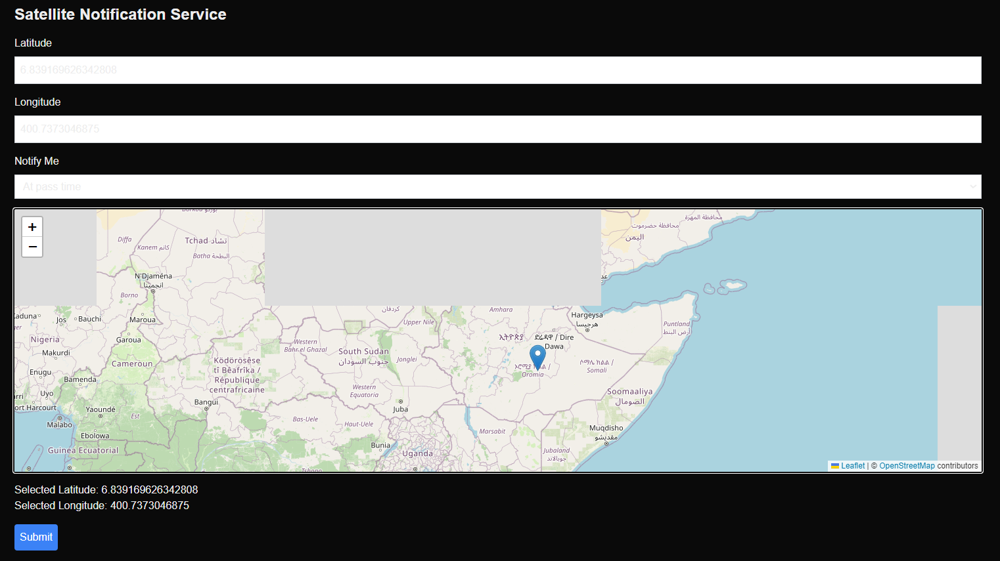

# Satellite Notification Service



## Overview
The **Satellite Notification Service** is a web application that allows users to get notified when a satellite passes over a selected location. Users can drop a pin on the map, enter coordinates manually, and choose how far in advance they would like to be notified.

## Features
- Interactive map for selecting coordinates (latitude and longitude).
- Integration with USGS Landsat satellite data for accurate satellite pass information.
- Multiple notification time options: at pass time, 1 hour before, 6 hours before, and 1 day before.
- Simple and intuitive UI for users to manage their notification preferences.

## Technologies Used
- **Next.js**: React-based framework for server-side rendering and static site generation.
- **React Leaflet**: For interactive map functionality.
- **USGS Landsat API**: For retrieving satellite pass information.
- **Tailwind CSS**: For styling the UI components.

## Installation

### Prerequisites
- **Node.js** (v14+)
- **npm** or **yarn**

### Steps
1. Clone the repository:
   ```bash
   git clone https://github.com/johntad110/LAM.git
   ```
2. Navigate to the project directory:
   ```bash
   cd LAM
   ```
3. Install dependencies:
   ```bash
   npm install
   ```
   or
   ```bash
   yarn install
   ```

4. Start the development server:
   ```bash
   npm run dev
   ```
   or
   ```bash
   yarn dev
   ```

5. Open the app in your browser:
   ```
   http://localhost:3000
   ```

## Usage
- On the homepage, use the interactive map to select the location (latitude and longitude) by clicking on the map.
- Fill in your notification preferences, such as when you want to be notified.
- Submit the form, and the app will use the USGS Landsat data to send you the desired notification based on your settings.

## API Integration
This app integrates with the USGS Landsat API to retrieve satellite pass times and ensure accurate notification delivery.

## Contributing
1. Fork the repository.
2. Create a new feature branch: 
   ```bash
   git checkout -b feature/new-feature
   ```
3. Commit your changes: 
   ```bash
   git commit -m 'Add new feature'
   ```
4. Push to the branch: 
   ```bash
   git push origin feature/new-feature
   ```
5. Open a pull request.

---